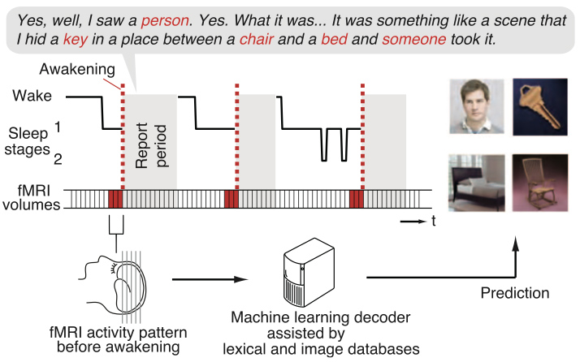

# Human Dream Decoding



This work has been published in *Science*,

Horikawa, T., Tamaki, M., Miyawaki, Y., & Kamitani, Y. (2013) "Neural decoding of visual imagery during sleep" Science 340, 639-642. <http://science.sciencemag.org/content/340/6132/639.long>

## Usage

### Download fMRI data

First, download raw fMRI data from <http://brainliner.jp/data/brainliner/Human_Dream_Decoding> and put them in `data/raw/` directory.
Data for all three subjects and all sessions are required.
Because the raw fMRI data is very large (>30GB), if you want to skip the following preprocessing step and start from the decoding analyses, you can download preprocessed data from the Supplementary File of the above web page.

### fMRI data preprocessing

To convert raw fMRI data to preprocessed data, change directory to the code/ and type:

``` matlab
>> convertRawDatatoPreprocessedData
```

in the MATLAB terminal.
The preprocessed data will be saved in `data/preproc/` directory.
Because the preprocessing requires over 30 GB memory (and it takes about an hour), it may be better to run this code on your cluster machine, not on your local PC.

### Perform stimulus-to-dream decoding anlaysis

To perform decoding analyses, type:

``` matlab
>> Perception2SleepDecoding_BATCH
```

This script performs the pair-wise decoding for all categories for all the subjects, and produces histograms of decoding accuracy for all the pairs (cf. Figure 3B in the original paper).

## Copyright and License

Copyright (c) 2015 ATR Department of Neuroinformatics

The data provided here is released under the Open Data Commons Attribution License, ODC BY (<http://opendatacommons.org/licenses/by/>).

The scripts provided here are released under the MIT license (<http://opensource.org/licenses/mit-license.php>).

Contact: brainliner-admin@atr.jp
